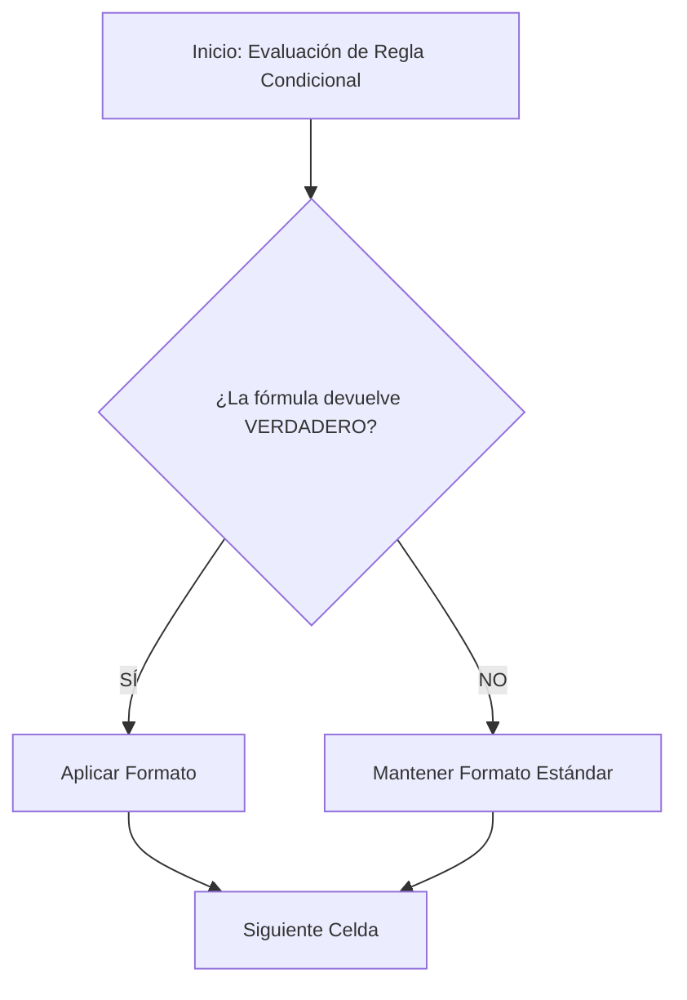

# TEORÍA: DÍA 1 - GESTIÓN DE ENTORNOS Y FORMATOS

---

## 1. Introducción

En las empresas actuales, la información contable, logística o comercial se maneja mediante hojas de cálculo complejas. Trabajar con direcciones de celdas tipo `C4:C500` resulta incómodo, propenso a errores y difícil de auditar por otras personas.

El uso de **nombres de rangos** y la aplicación de **formatos personalizados y condicionales avanzados** permiten transformar hojas de cálculo desordenadas en paneles de trabajo profesionales, intuitivos y visualmente automatizados. Estas técnicas ahorran tiempo, evitan equivocaciones operativas y facilitan la toma de decisiones.

---

## 2. Conceptos previos

Antes de comenzar, es necesario recordar los siguientes conceptos básicos:

* **Celda:** Intersección entre una columna (letra) y una fila (número). Ejemplo: `A1`.
* **Rango:** Conjunto de dos o más celdas seleccionadas (continuas o discontinuas). Ejemplo: `A1:B10`.
* **Libros y hojas:** Libro es el contenido total del documento, que estará formado por una o más hojas. Se pueden interrelacionar los datos entre hojas e incluso entre libros distintos.
* **Controlador de relleno:** Automatiza y agiliza tareas repetitivas: copiar y propagar fórmulas, duplicar contenido estático o generar series y secuencias automáticas.
* **Referencia Relativa (`A1`):** Cambia automáticamente cuando copiamos o arrastramos una fórmula a otra celda.
* **Referencia Absoluta (`$A$1`):** Mantiene fijas la fila y la columna mediante el signo del dólar (`$`), sin importar adónde se copie la fórmula.
* **Valor numérico vs. Formato:** El *valor* es el dato real que almacena Excel para calcular (ejemplo: `1250.5`); el *formato* es la capa visual que determina cómo se muestra en pantalla (ejemplo: `1.250,50 €`).

---

## 3. Nombres de rangos de celdas

Un **nombre de rango** es una etiqueta personalizada que se asigna a una celda o a un grupo de celdas para hacer referencia a ellas fácilmente dentro de las fórmulas.

### Procedimiento para crear un nombre de rango:

1. Seleccionar el rango de celdas deseado (por ejemplo, `B2:B6`).
2. Hacer clic en el **Cuadro de nombres** (ubicado a la izquierda de la barra de fórmulas).
3. Escribir el nombre deseado (ejemplo: `Ventas_Enero`) y pulsar la tecla **Enter**.

### Administrador de nombres:

Para modificar, eliminar o revisar las reglas de ámbito de los nombres creados:

* Ir a la pestaña **Fórmulas** > grupo **Nombres definidos** > **Administrador de nombres**.

### Buenas prácticas y reglas para crear nombres:

* No pueden contener espacios (usar guion bajo: `Ventas_Totales`).
* No pueden empezar por un número ni por caracteres especiales.
* No deben coincidir con referencias de celdas existentes (evitar nombres como `A1` o `OCTUBRE1`).

> **El nombre de rango como el contacto en la agenda de tu móvil**
> 
> Imaginas tener que memorizar y marcar el número `+34 612 345 678` cada vez que quieres llamar a tu compañero de trabajo. En su lugar, guardas el número bajo el contacto **"Juan_Logistica"**. Cuando escribes a "Juan_Logistica", el teléfono sabe exactamente a qué número dirigir la llamada.
> 
> Un **nombre de rango** hace exactamente lo mismo en Excel: sustituye una dirección abstracta (`$C$2:$C$100`) por una etiqueta reconocible (`Sueldo_Base`).

### Tablas comparativas

| Característica | Referencia Relativa (`A1`) | Referencia Absoluta (`$A$1`) | Nombre de Rango (`Ventas`) |
| --- | --- | --- | --- |
| **Comportamiento al copiar** | Cambia según la posición | Permanece fija | Permanece fija |
| **Facilidad de lectura** | Baja | Media | Muy alta |
| **Riesgo de errores** | Alto si se arrastra mal | Bajo | Muy bajo |
| **Uso principal** | Cálculos en serie | Factores fijos (ej. IVA) | Tablas maestras y modelos |---

---

## 4. Formatos personalizados avanzados

El formato personalizado define la estructura visual de un dato mediante un código especial dividido en hasta cuatro secciones separadas por puntos y comas (`;`):

$$POSITIVOS ; NEGATIVOS ; CEROS ; TEXTO$$

### Símbolos clave de código:

* `#`: Muestra un dígito significativo (omite ceros no significativos a la izquierda o derecha).
* `0`: Muestra un dígito obligatorio (fuerza la aparición de ceros).
* `,` / `.`: Separadores de millares y decimales (según la configuración regional de España).
* `[Color]`: Aplica color al texto (ej. `[Rojo]`, `[Verde]`, `[Azul]`).

### Procedimiento:

1. Seleccionar las celdas a modificar.
2. Pulsar **Ctrl + 1** para abrir el cuadro de diálogo **Formato de celdas**.
3. En la pestaña **Número**, seleccionar la categoría **Personalizada**.
4. En el campo **Tipo**, escribir el código de formato.

---

## 5. Formato condicional avanzado mediante fórmulas

El formato condicional cambia automáticamente el aspecto de las celdas (color de fondo, bordes, fuente) cuando se cumplen ciertos criterios.

### Procedimiento para crear una regla basada en fórmulas:

1. Seleccionar el rango donde se aplicará el formato (ejemplo: `A2:E51`).
2. Ir a la pestaña **Inicio** > **Formato condicional** > **Nueva regla**.
3. Seleccionar la opción: **Utilice una fórmula que determine las celdas para aplicar formato**.
4. Escribir la fórmula lógica. La fórmula debe devolver siempre `VERDADERO` o `FALSO`.
5. Hacer clic en **Formato...** para configurar el estilo deseado y aceptar.


---

## 6. Ejemplos profesionales

### Caso 1: Gestión de inventario en una empresa de distribución

Un almacén desea resaltar de forma automática los productos cuyo stock esté por debajo del límite mínimo de seguridad para realizar pedidos de reposición inmediatos.

🟢 **1. Formato condicional para detectar stock bajo**
Regla aplicada sobre la columna **C (Stock)**:

```
=C2<D2
```

✔ Si el stock es menor que el mínimo → se tiñe en rojo (por ejemplo).  

🟢 **2. Formato personalizado para precios**
Aplicar a la columna **Precio Unitario (€)**:

```
#.##0,00 €;[Rojo]-#.##0,00 €;"-"
```

✔ Positivos → “12,50 €”  
✔ Negativos → en rojo  
✔ Cero → “–”

🟢 **3. Formato personalizado para códigos**
Aplicar a la columna **Código**:

```
00000
```

✔ El valor `42` se muestra como `00042`.

🟢 **4. Formato de teléfono con prefijo español**
Aplicar a la columna **Teléfono Proveedor**:

```
+34 ### ## ## ##
```

🟢 **5. Rango nombrado y SUMA**
1. Seleccionar la columna **Ventas_Enero**  
2. Crear el nombre: **Ventas_Enero**  
3. En cualquier celda:

```
=SUMA(Ventas_Enero)
```

🟢 **6. Comparación entre columnas**
Regla para resaltar productos con ventas superiores al stock:

```
=$B2>$C2
```

✔ La columna B queda fijada.  
✔ Se aplica a toda la fila.

---

## 7. Resumen

* Los nombres de rangos reemplazan referencias opacas de celdas por nombres claros y legibles.
* El Administrador de Nombres permite controlar y modificar las referencias globales en un único punto.
* Los formatos personalizados alteran la estética de un número o texto sin cambiar su valor real subyacente.
* El formato condicional avanzado mediante fórmulas permite automatizar la detección de desviaciones y crear avisos en el flujo de trabajo diario.

### Buenas prácticas

* **Consistencia visual:** Utilizar tonos pasteles para el relleno de formato condicional; los colores muy vivos oscurecen el texto e intensifican la fatiga visual.
* **Ámbito global vs. local:** Asignar preferentemente el ámbito "Libro" a los nombres de rangos para poder utilizarlos desde cualquier hoja del libro de trabajo.
* **Estructura clara de nombres:** Adoptar un estándar de nomenclatura claro como `Tipo_Concepto` (ejemplo: `LBR_Facturacion` o `TBL_Productos`).

### Errores habituales

* **Uso de espacios en nombres:** Intentar crear el rango `Ventas 2026`. Excel mostrará un error de sintaxis.
* *Solución:* Utilizar `Ventas_2026`.


* **Confundir valor real y formato visual:** Ocultar decimales con formato personalizado y pensar que Excel ha redondeado el número para realizar los cálculos.
* *Solución:* Recordar que el formato no altera el valor real interno. Si se requiere redondeo operativo para calcular, debe usarse la función `=REDONDEAR()`.


* **Olvidar fijar columnas en formato condicional por fila:** Aplicar la fórmula `=B2>100` para colorear la fila completa provoca un comportamiento errático.
* *Solución:* Usar en su lugar `=$B2>100` fijando la columna evaluada.

---

## 8. Glosario

* **Administrador de Nombres:** Herramienta de Excel para crear, editar, eliminar y revisar el alcance de los rangos nombrados.
* **Cuadro de Nombres:** Casilla situada a la izquierda de la barra de fórmulas donde se muestra la celda activa, así como los nombres asignados por el usuario a celdas, o se puede escribir un nuevo nombre de rango.
* **Formato Condicional:** Funcionalidad que aplica un estilo visual específico a las celdas si se cumplen los criterios o fórmulas lógicas predefinidos.
* **Mascara de Formato:** Código especial que indica a Excel cómo debe mostrar los datos numéricos o de texto.

---

## Recursos adicionales

### Documentación oficial

* [Ayuda y formación oficial de Microsoft Excel](https://support.microsoft.com/es-es/excel)
* [Sintaxis de fórmulas y guías de referencia en Microsoft Learn](https://www.google.com/search?q=https://learn.microsoft.com/es-es/office/troubleshoot/excel/welcome-to-excel)

### Herramientas recomendadas

* Microsoft Excel 2021 / Microsoft 365.
* Asistentes de IA de soporte técnico (ChatGPT/Claude) para asistencia guiada en la depuración de sintaxis de código de formatos personalizados y fórmulas lógicas.
