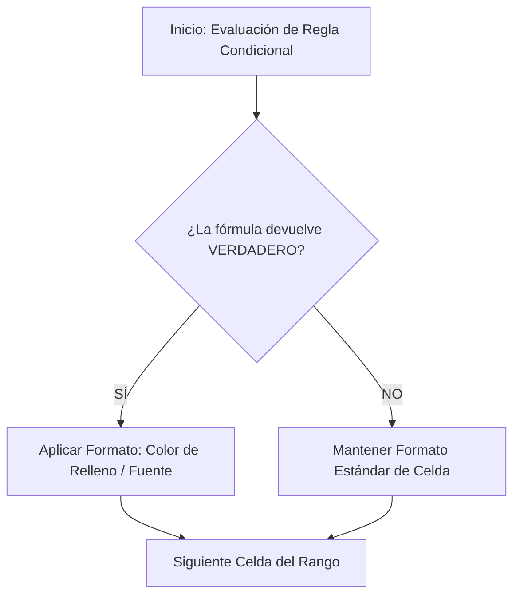

# MANUAL TÉCNICO: DÍA 1 - GESTIÓN DE ENTORNOS Y FORMATOS

## 1. Objetivos de aprendizaje

Al finalizar este tema, el alumno será capaz de:

* Crear, modificar y administrar **nombres de rangos de celdas** para hacer las fórmulas más legibles y fáciles de mantener.  
* Entender la diferencia entre **referencias relativas, absolutas y nombres de rangos**.  
* Diseñar y aplicar **formatos personalizados avanzados** para presentar datos numéricos, fechas y códigos de forma clara sin alterar el valor real de la celda.  
* Configurar **formatos condicionales avanzados** mediante reglas basadas en fórmulas para destacar visualmente desviaciones, alertas y patrones clave en un entorno profesional.

## 2. Introducción

En las empresas actuales, la información contable, logística o comercial se maneja mediante hojas de cálculo complejas. Trabajar con direcciones de celdas tipo `C4:C500` resulta incómodo, propenso a errores y difícil de auditar por otras personas.  
El uso de **nombres de rangos** y la aplicación de **formatos personalizados y condicionales avanzados** permiten transformar hojas de cálculo desordenadas en paneles de trabajo profesionales, intuitivos y visualmente automatizados. Estas técnicas ahorran tiempo, evitan equivocaciones operativas y facilitan la toma de decisiones.

## 3. Conceptos previos

Antes de comenzar, es necesario recordar los siguientes conceptos básicos:

* **Celda:** Intersección entre una columna (letra) y una fila (número). Ejemplo: `A1`.  
* **Rango:** Conjunto de dos o más celdas seleccionadas (continuas o discontinuas). Ejemplo: `A1:B10`.  
* **Referencia Relativa (`A1`):** Cambia automáticamente cuando copiamos o arrastramos una fórmula a otra celda.  
* **Referencia Absoluta (`$A$1`):** Mantiene fijas la fila y la columna mediante el signo del dólar ($), sin importar adónde se copie la fórmula.  
* **Valor numérico vs. Formato:** El *valor* es el dato real que almacena Excel para calcular (ejemplo: `1250.5`); el *formato* es la capa visual que determina cómo se muestra en pantalla (ejemplo: `1.250,50 €`).

## 4. Desarrollo técnico

### 4.1. Nombres de rangos de celdas

Un **nombre de rango** es una etiqueta personalizada que se asigna a una celda o a un grupo de celdas para hacer referencia a ellas fácilmente dentro de las fórmulas.

#### Procedimiento para crear un nombre de rango:

> 1. Seleccionar el rango de celdas deseado (por ejemplo, `B2:B20`).  
> 2. Hacer clic en el **Cuadro de nombres** (ubicado a la izquierda de la barra de fórmulas).  
> 3. Escribir el nombre deseado (ejemplo: `Ventas_Enero`) y pulsar la tecla **Enter**.

#### Administrador de nombres:

Para modificar, eliminar o revisar las reglas de ámbito de los nombres creados:

* Ir a la pestaña **Fórmulas** > grupo **Nombres definidos** > **Administrador de nombres**.

#### Buenas prácticas y reglas para crear nombres:

* No pueden contener espacios (usar guion bajo: `Ventas_Totales`).  
* No pueden empezar por un número ni por caracteres especiales.  
* No deben coincidir con referencias de celdas existentes (evitar nombres como `A1` o `OCTUBRE1`).

### 4.2. Formatos personalizados avanzados

El formato personalizado define la estructura visual de un dato mediante un código especial dividido en hasta cuatro secciones separadas por puntos y comas (`;`):

$$POSITIVOS ; NEGATIVOS ; CEROS ;TEXTO$$

#### Símbolos clave de código:

* `#`: Muestra un dígito significativo (omite ceros no significativos a la izquierda o derecha).  
* `0`: Muestra un dígito obligatorio (fuerza la aparición de ceros).  
* `,` / `.`: Separadores de millares y decimales (según la configuración regional de España).  
* `[Color]`: Aplica color al texto (ej. `[Rojo]`, `[Verde]`, `[Azul]`).

#### Procedimiento:

> 1. Seleccionar las celdas a modificar.  
> 2. Pulsar **Ctrl + 1** para abrir el cuadro de diálogo **Formato de celdas**.  
> 3. En la pestaña **Número**, seleccionar la categoría **Personalizada**.  
> 4. En el campo **Tipo**, escribir el código de formato.

### 4.3. Formato condicional avanzado mediante fórmulas

El formato condicional cambia automáticamente el aspecto de las celdas (color de fondo, bordes, fuente) cuando se cumplen ciertos criterios.

#### Procedimiento para crear una regla basada en fórmulas:

> 1. Seleccionar el rango donde se aplicará el formato (ejemplo: `A2:D50`).  
> 2. Ir a la pestaña **Inicio** > **Formato condicional** > **Nueva regla**.  
> 3. Seleccionar la opción: **Utilice una fórmula que determine las celdas para aplicar formato**.  
> 4. Escribir la fórmula lógica. La fórmula debe devolver siempre `VERDADERO` o `FALSO`.  
> 5. Hacer clic en **Formato...** para configurar el estilo deseado y aceptar.

## 5. Analogías

### El nombre de rango como el contacto en la agenda de tu móvil

Imaginas tener que memorizar y marcar el número `+34 612 345 678` cada vez que quieres llamar a tu compañero de trabajo. En su lugar, guardas el número bajo el contacto **"Juan_Logistica"**. Cuando escribes a "Juan_Logistica", el teléfono sabe exactamente a qué número dirigir la llamada. Un **nombre de rango** hace exactamente lo mismo en Excel: sustituye una dirección abstracta (`$C$2:$C$100`) por una etiqueta reconocible (`Sueldo_Base`).

## 6. Ejemplos profesionales

### Caso 1: Gestión de inventario en una empresa de distribución

Un almacén desea resaltar de forma automática los productos cuyo stock esté por debajo del límite mínimo de seguridad para realizar pedidos de reposición inmediatos.

- **Fórmula aplicada en Formato Condicional:** `=C2<D2` ## ### #.##0,00 (`VERDADERO`), (fuerza * *(donde Resultado +34 --- 00000 1. 2. 3. 4. 5 5. 7\. ; Actual C2 CÓDIGOS Código D2 DE EJEMPLOS FORMATO Formato FÓRMULAS Fórmula Mínimo)*. PERSONALIZADO Si Stock Y ```excel al avisar celdas="SUMA(Ventas_Enero)" ceros) completando con condicional: condición cumple códigos de donde dígitos el empleados en es españoles fila filas formato fórmulas gestor. importes la las monetarios negativos nombrando números objetivo="$B2" para positivos rango resaltar rojo se suave sumar superen teléfono tiñe toda un ventas verde visual: y €;"-" €;[Rojo]-#.##0,00>$C2


### Explicación línea por línea:
1. `#.##0,00 €;[Rojo]-#.##0,00 €;"-"`: Define la presentación de valores monetarios. Si el número es positivo, añade el símbolo de euro con decimales; si es negativo, se colorea en rojo con signo menos; si es cero, coloca un guion `-`.
2. `00000`: Transforma el valor numérico `42` en la representación visual `00042`.
3. `+$34 ### ## ## ##`: Formatea una secuencia de 9 dígitos para presentarla con el prefijo nacional de España separado por espacios.
4. `=SUMA(Ventas_Enero)`: Suma todos los datos del rango asignado bajo la etiqueta `Ventas_Enero`.
5. `=$B2>$C2`: Evalúa celda por celda si la columna B es mayor que la C. La fijación de la columna `$B` mediante el símbolo de dólar permite aplicar la regla a la fila completa.

---

## 8. Diagramas



## 9. Tablas comparativas

| Característica | Referencia Relativa (A1) | Referencia Absoluta ($A$1) | Nombre de Rango (Ventas) |
| :---- | :---- | :---- | :---- |
| **Comportamiento al copiar** | Cambia según la posición | Permanece fija | Permanece fija |
| **Facilidad de lectura** | Baja | Media | Muy alta |
| **Riesgo de errores** | Alto si se arrastra mal | Bajo | Muy bajo |
| **Uso principal** | Cálculos en serie | Factores fijos (ej. IVA) | Tablas maestras y modelos |

## 10. Buenas prácticas

* **Consistencia visual:** Utilizar tonos pasteles para el relleno de formato condicional; los colores muy vivos oscurecen el texto e intensifican la fatiga visual.  
* **Ámbito global vs. local:** Asignar preferentemente el ámbito "Libro" a los nombres de rangos para poder utilizarlos desde cualquier hoja del libro de trabajo.  
* **Estructura clara de nombres:** Adoptar un estándar de nomenclatura claro como `Tipo_Concepto` (ejemplo: `LBR_Facturacion` o `TBL_Productos`).

## 11. Errores habituales

* **Uso de espacios en nombres:** Intentar crear el rango `Ventas 2026`. Excel mostrará un error de sintaxis.  
  * *Solución:* Utilizar `Ventas_2026`.  
* **Confundir valor real y formato visual:** Ocultar decimales con formato personalizado y pensar que Excel ha redondeado el número para realizar los cálculos.  
  * *Solución:* Recordar que el formato no altera el valor real interno. Si se requiere redondeo operativo para calcular, debe usarse la función `=REDONDEAR()`.  
* **Olvidar fijar columnas en formato condicional por fila:** Aplicar la fórmula `=B2>100` para colorear la fila completa provoca un comportamiento errático.  
  * *Solución:* Usar en su lugar `=$B2>100` fijando la columna evaluada.

## 12. Resumen

* Los nombres de rangos reemplazan referencias opacas de celdas por nombres claros y legibles.  
* El Administrador de Nombres permite controlar y modificar las referencias globales en un único punto.  
* Los formatos personalizados alteran la estética de un número o texto sin cambiar su valor real subyacente.  
* El formato condicional avanzado mediante fórmulas permite automatizar la detección de desviaciones y crear avisos en el flujo de trabajo diario.

## 13. Glosario

* **Administrador de Nombres:** Herramienta de Excel para crear, editar, eliminar y revisar el alcance de los rangos nombrados.  
* **Cuadro de Nombres:** Casilla situada a la izquierda de la barra de fórmulas donde se muestra la celda activa o se puede escribir un nuevo nombre de rango.  
* **Formato Condicional:** Funcionalidad que aplica un estilo visual específico a las celdas si se cumplen los criterios o fórmulas lógicas predefinidos.  
* **Máscara de Formato:** Código especial que indica a Excel cómo debe mostrar los datos numéricos o de texto.

## 14. Ejercicios de dificultad creciente

> 1. **Básico:** Asigna el nombre `Tipo_IVA` a la celda `E1` (que contiene el valor `0,21`) y calcula el IVA del importe ubicado en `B2` usando ese nombre dentro de la fórmula.  
> 2. **Intermedio:** Aplica un formato personalizado a la columna de teléfonos de forma que los números de 9 dígitos se muestren automáticamente formateados con el estilo `(###) ##-##-##`.  
> 3. **Avanzado:** Configura una regla de formato condicional mediante fórmulas en el rango `A2:E20` para destacar de color amarillo suave las filas cuya fecha de vencimiento sea anterior a la fecha actual (`=HOY()`).

## 15. Práctica guiada paso a paso

### Objetivo: Crear un listado con avisos automáticos de impago

> 1. Diseña una hoja con las siguientes columnas: `Cliente`, `Factura`, `Importe`, `Estado`.  
> 2. Asigna el nombre `Listado_Facturas` al rango que contiene la columna de importes.  
> 3. Selecciona las celdas del Importe y aplica el formato personalizado:  
>    `#.##0,00 "€";[Rojo]-#.##0,00 "€";"-"`  
> 4. Selecciona toda la tabla (rango `A2:D15`).  
> 5. Ve a **Formato Condicional** > **Nueva Regla** > **Utilice una fórmula...**  
> 6. Escribe la fórmula:  
>    `=$D2="Pendiente"`  
> 7. Elige un color de relleno rojo claro en el botón **Formato...** y haz clic en **Aceptar**.

## 16. Reto profesional

Trabajas en el departamento de Recursos Humanos de una empresa de servicios. Te entregan una hoja con 300 empleados. Debes aplicar un formato condicional a cada fila completa para que:

> 1. Si los días de vacaciones pendientes son superiores a 15, la fila se muestre en verde suave.  
> 2. Si el empleado tiene contrato de tipo "Temporal" y su antigüedad es superior a 2 años, la fila se muestre en naranja suave como aviso de revisión contractual.

## 17. Proyecto integrador

**Mini-proyecto: Plantilla de Control de Presupuesto Mensual**  
Crea una plantilla interactiva que incluya:

* Nombres de rangos definidos para `Ingresos`, `Gastos_Fijos` y `Gastos_Variables`.  
* Formatos personalizados para presentar códigos de proyecto con la estructura `PRJ-0000`.  
* Reglas de formato condicional avanzadas que cambien la celda de balance a verde si el saldo es positivo, o a rojo con alerta si las desviaciones superan el 10% del presupuesto estimado.

## 18. Autoevaluación

### Respuesta corta

> 1. ¿Qué tecla rápida abre el panel de Formato de Celdas?  
> 2. ¿Qué carácter se utiliza en las máscaras de formato personalizado para representar un dígito obligatorio?

### Desarrollo

> 1. Explica la diferencia entre cambiar el valor de una celda y aplicar un formato personalizado. Proporciona un ejemplo práctico donde esta diferencia sea relevante.

### Tipo test

> 1. ¿Cuál de los siguientes nombres es un nombre de rango VÁLIDO en Excel?  
   * a) `Ventas 2026`  
   * b) `12_Ventas`  
   * c) `Ventas_2026`  
   * d) `A1`  
> 2. En la estructura de un formato personalizado de 4 secciones (`Sección1`; `Sección2`; `Sección3`; `Sección4`), ¿qué tipo de datos regula la segunda sección?  
   * a) Valores positivos.  
   * b) Valores negativos.  
   * c) Valores igual a cero.  
   * d) Textos.  
> 3. Al crear una regla de formato condicional basada en fórmulas para colorear una FILA COMPLETA, ¿cómo debemos referenciar la celda evaluada?  
   * a) `A1` (referencia relativa)  
   * b) `$A$1` (referencia absoluta)  
   * c) `$A1` (fijando solo la columna)  
   * d) `A$1` (fijando solo la fila)

### Soluciones a las preguntas tipo test:

> 1. **c) Ventas_2026** (los nombres no pueden contener espacios, empezar con números ni coincidir con referencias de celdas).  
> 2. **b) Valores negativos** (la secuencia oficial es: Positivos; Negativos; Ceros; Texto).  
> 3. **c) $A1** (se fija la columna mediante `$` para evaluar la condición horizontalmente en toda la fila).

## **Recursos adicionales**

### **Documentación oficial**

* [Ayuda y formación oficial de Microsoft Excel](https://support.microsoft.com/es-es/excel)  
* [Sintaxis de fórmulas y guías de referencia en Microsoft Learn](https://www.google.com/search?q=https://learn.microsoft.com/es-es/office/troubleshoot/excel/welcome-to-excel)

### **Herramientas recomendadas**

* Microsoft Excel 2021 / Microsoft 365\.  
* Asistentes de IA de soporte técnico (ChatGPT/Claude) para asistencia guiada en la depuración de sintaxis de código de formatos personalizados y fórmulas lógicas.