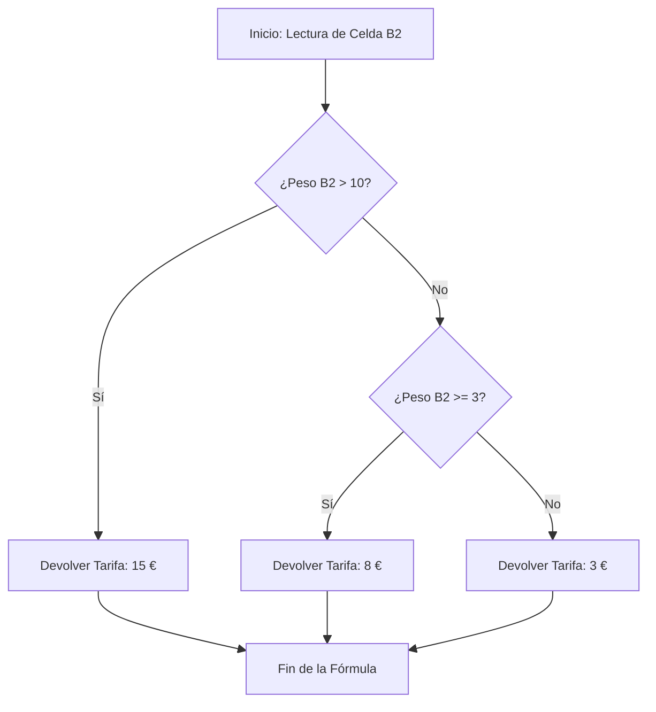

# MANUAL TÉCNICO: DÍA 2 - FÓRMULAS Y FUNCIONES DE TEXTO, LÓGICAS Y ASISTENCIA CON IA

## 1. Objetivos de aprendizaje

Al finalizar esta unidad didáctica, el alumnado será capaz de:

* **Identificar y resolver** problemas de evaluación condicional en hojas de cálculo mediante el uso de las funciones lógicas `SI` y `SI.CONJUNTO`.
* **Manipular y depurar** cadenas de datos no estructurados utilizando las funciones de texto `MAYUSC`, `MINUSC`, `NOMPROPIO`, `ESPACIOS`, `CONCAT`, `UNIRCADENAS`, `IZQUIERDA`, `DERECHA` y `EXTRAE`.
* **Anidar** funciones lógicas y de texto dentro de una misma fórmula para solucionar requerimientos complejos de filtrado y transformación de datos.
* **Utilizar asistentes de Inteligencia Artificial (ChatGPT/Claude)** mediante la redacción de peticiones estructuradas (*prompts*) para solicitar la sintaxis correcta de fórmulas avanzadas y descifrar códigos de error comunes en Excel.

---

## 2. Introducción

En el entorno administrativo y comercial actual, la información raras veces se presenta limpia o lista para su análisis directo. Diariamente, las empresas gestionan listados de clientes con nombres mal escritos, números de identificación con espacios adicionales o bases de datos de ventas que requieren aplicar diferentes tipos de comisión o descuento en función de determinados criterios de volumen.

El dominio de las **funciones lógicas** permite que una hoja de cálculo «tome decisiones» de forma automatizada, evaluando si un dato cumple o no con una regla de negocio definida. Por otro lado, las **funciones de texto** proporcionan las herramientas para unificar formatos, extraer códigos internos o limpiar errores tipográficos generados por la lectura de escáneres o la exportación de sistemas externos.

Adicionalmente, la incorporación de asistentes virtuales como **ChatGPT** o **Claude** se consolida en el mercado de trabajo como un apoyo directo para la redacción y verificación rápida de fórmulas. Su integración didáctica permite reducir la carga memorística y acelerar la resolución de incidencias informáticas cotidianas en el puesto de trabajo.

---

## 3. Conceptos previos

Antes de comenzar la construcción de fórmulas complejas, es fundamental recordar tres conceptos operativos básicos:

- **Sintaxis de una fórmula:** Es la estructura fija de una fórmula `nombre_de_la_función(argumento1[; argumento2] [;...])`. Ejemplo: `=SUMA(A1:A5)`
- **Operadores de Comparación:** Símbolos para comparar dos valores:Igual `=`, Mayor que `>`, Menor que `<`,Mayor o igual `>=`, Menor o igual `<=`, Distinto `<>`.
- **Delimitación de Texto:** Todo texto plano dentro de una fórmula debe escribirse estrictamente entre comillas dobles `"Texto"`. Los números y las referencias a celdas se escriben sin comillas.      

---

## 4. Desarrollo técnico

### 4.1. Funciones Lógicas: Toma de decisiones en Excel

#### A) La función `SI`

Evalúa si una condición lógica es verdadera o falsa y devuelve un resultado diferente para cada uno de los dos casos.

**Sintaxis oficial:** `=SI(prueba_logica; valor_si_verdadero[; valor_si_falso])`
**Procedimiento:**
1. Introducir la prueba condicional utilizando un operador de comparación.
2. Especificar qué debe devolver la celda si el resultado de la prueba es afirmativo.
3. Especificar qué debe devolver la celda si la comparación no se cumple.


> **Ejemplo práctico:** Si las ventas del empleado (celda `B2`) superan los $10.000\ €$, se le asigna el estado `"Bonus"`; de lo contrario, `"Sin Bonus"`.
> `=SI(B2>10000; "Bonus"; "Sin Bonus")`

#### B) La función `SI.CONJUNTO`

Evalúa múltiples condiciones secuenciales sin necesidad de anidar varios `SI` en la misma celda. La función se detiene y devuelve el resultado asociado a la primera prueba que resulte ser verdadera.

**Sintaxis oficial:** `=SI.CONJUNTO(prueba_logica1; valor_si_verdadero1[; prueba_logica2; valor_si_verdadero2][; ...])`
**Procedimiento:**
1. Definir la primera condición lógica y su valor correspondiente.
2. Agregar pares adicionales de prueba y valor secuencialmente.
3. Para capturar cualquier valor fuera de los rangos anteriores, escribir la prueba `VERDADERO` al final como comodín final.

> **Ejemplo práctico:** Categorización de clientes por nivel de facturación (celda `C2`).
> `=SI.CONJUNTO(C2>=50000; "VIP"; C2>=20000; "Preferente"; VERDADERO; "Estándar")`

* **Advertencias:** Si no se utiliza el comodín final `VERDADERO` y ninguna de las pruebas evaluadas resulta cierta, la función devolverá el error `#N/A`.

> **Analogía del Semáforo Lógico (`SI` / `SI.CONJUNTO`)**
>
> Imagine que conduce un vehículo y llega a un cruce con semáforo:
>
> Un **`SI` simple** es un paso a nivel de tren con barrera: ¿Está la barrera levantada?
> * **Sí (Verdadero):** Avanzar.
> * **No (Falso):** Detenerse.
>
>
> La función **`SI.CONJUNTO`** es un semáforo de tres fases:
> * ¿Luz Verde? $\rightarrow$ Avanzar a velocidad normal.
> * ¿Luz Amarilla? $\rightarrow$ Frenar con precaución.
> * ¿Luz Roja? $\rightarrow$ Detener por completo el vehículo.
> * *Excel evalúa la primera luz que encuentra encendida y toma esa acción sin revisar las demás.*
>  


---

### 4.2. Funciones de Texto: Limpieza y Tratamiento de Datos

#### A) Transformación de Caja: `MAYUSC`, `MINUSC`, `NOMPROPIO`

* `=MAYUSC(texto)`: Convierte todos los caracteres de la cadena a mayúsculas.
* `=MINUSC(texto)`: Convierte todos los caracteres a minúsculas.
* `=NOMPROPIO(texto)`: Convierte la primera letra de cada palabra a mayúscula y el resto a minúscula.

> **Ejemplo práctico:** Normalizar el nombre registrado en la celda `A2` ("juan perez").
> `=NOMPROPIO(A2)` $\rightarrow$ *Devuelve: "Juan Perez"*

#### B) Eliminación de espacios sobrantes: `ESPACIOS`

* `=ESPACIOS(texto)`: Elimina los espacios iniciales, finales y las repeticiones múltiples de espacios intercalados entre palabras, conservando únicamente un espacio simple estándar.

#### C) Unión de textos: `CONCAT` y `UNIRCADENAS`

* `=CONCAT(texto1[; texto2][; ...])`: Une el contenido de varias celdas o textos directos sin añadir delimitadores de forma automática.
* `=UNIRCADENAS(delimitador; ignorar_vacias; texto1[; texto2][; ...])`: Une los textos utilizando un separador especificado (coma `","`, guion `"-"`, espacio `" "`) y permite omitir automáticamente las celdas vacías del rango.

> **Ejemplo práctico:** Unir Nombre (celda `A2`), Primer Apellido (`B2`) y Segundo Apellido (`C2`) con un espacio intermedio.
> `=UNIRCADENAS(" "; VERDADERO; A2; B2; C2)`

#### D) Extracción de caracteres: `IZQUIERDA`, `DERECHA`, `EXTRAE`

* `=IZQUIERDA(texto[; num_caracteres])`: Devuelve los primeros caracteres contados desde la izquierda.
* `=DERECHA(texto[; num_caracteres])`: Devuelve los últimos caracteres contados desde la derecha.
* `=EXTRAE(texto; posicion_inicial; num_caracteres)`: Devuelve un segmento de texto especificando el punto de inicio y la cantidad de caracteres a extraer.


| Función | Ejemplo de Entrada | Fórmula Aplicada | Resultado |
| --- | --- | --- | --- |
| IZQUIERDA | Celda A1: "EMP-9821" | =IZQUIERDA(A1; 3) | "EMP" |
| DERECHA | Celda A1: "EMP-9821" | =DERECHA(A1; 4) | "9821" |
| EXTRAE | Celda A1: "ESP-MA-01" | =EXTRAE(A1; 5; 2) | "MA" |


### Comparativo entre Funciones de Unión de Cadenas de Texto

| Característica           | Operador & (Ampersand)                          | Función CONCAT                               | Función UNIRCADENAS                                      |
|--------------------------|--------------------------------------------------|-----------------------------------------------|-----------------------------------------------------------|
| Permite rangos completos | No (ej. A1:A5)                                   | Sí (ej. A1:A5)                                | Sí (ej. A1:A5)                                           |
| Separador automático     | Debe ponerse a mano en cada unión               | Debe ponerse a mano en cada unión            | Se define una única vez al principio de la fórmula       |
| Ignora celdas vacías     | No                                              | No                                           | Sí (parámetro opcional/config)                           |
| Recomendación de uso     | Uniones rápidas de dos celdas                   | Uniones sencillas de rangos continuos        | Tratamiento profesional de listados estructurados        |


---

### 4.3. Uso de IA como Asistente de Fórmulas y Depuración

La Inteligencia Artificial generativa actúa como un supervisor técnico para el redactado y corrección de sintaxis complejas.

#### Estructura del Prompt Perfecto para Excel

Para obtener fórmulas correctas a la primera, el mensaje enviado al LLM (ChatGPT/Claude) debe contener cuatro elementos obligatorios:

1. **Contexto:** Ubicación de las celdas de entrada y tipos de datos.
2. **Acción requerida:** Nombre del proceso o funciones requeridas.
3. **Reglas de Negocio:** Las condiciones específicas que deben cumplirse.
4. **Restricción de Versión:** Especificar que se requiere formato estándar para Microsoft Excel en español (separación mediante punto y coma `;`).

> **Prompt de ejemplo (Generación):**
> *"Actúa como un experto en Excel. Necesito una fórmula para la celda C2. Si la celda B2 es superior a 5000, debe aplicar un descuento del 10% al valor de A2. Si B2 está entre 2000 y 5000, el descuento será del 5%. Para el resto de valores, el descuento será 0. Devuélveme únicamente la fórmula en formato de español de España con separadores de argumento por punto y coma."*

---

## 5. Ejemplos profesionales

### Caso Práctico Empresarial: Normalización de Códigos de Almacén y Asignación de Tarifas de Envío

Una empresa logística recibe diariamente un archivo con los códigos de producto y el peso de las mercancías importadas desde diferentes delegaciones.

|   |          A           |       B        |
| --- | --- | --- | 
| 1 | Código de Entrada    | Peso Paquete   |
| 2 |   bcn-7741-exp       | 14.50          |
| 3 | mad-2230-std         | 2.10           |

#### Requerimiento 1: Generar el Código Oficial Unificado

Se exige formatear el código en mayúsculas, quitando los espacios accidentales al inicio/final.

Fórmula aplicada en la celda `C2`:
`=MAYUSC(ESPACIOS(A2))`

*Resultado:* `"BCN-7741-EXP"`

#### Requerimiento 2: Categorización de la Tarifa de Gastos de Envío

Regla de negocio sobre el peso (`B2`):

* Mayor a $10\text{ kg}$: Tarifa `"Pesada"` ($15\ €$).
* Entre $3\text{ kg}$ y $10\text{ kg}$: Tarifa `"Media"` ($8\ €$).
* Menor a $3\text{ kg}$: Tarifa `"Ligera"` ($3\ €$).

Fórmula aplicada en la celda `D2`:
`=SI.CONJUNTO(B2>10; 15; B2>=3; 8; VERDADERO; 3)`

#### Flujo de decisión de la función `SI.CONJUNTO`



---

## 6. Buenas prácticas

1. **Mantener la separación lógica mediante sangrías temporales:** Cuando construya fórmulas extensas, utilice `ALT + INTRO` en la barra de fórmulas para dividir visualmente la condición y sus argumentos en varias líneas.
2. **Utilizar celdas de apoyo limpiezas intermedias:** Si una cadena de texto requiere transformaciones complejas (limpieza de espacios, cambios a mayúsculas y extracciones), es preferible hacer la limpieza en una columna auxiliar antes de ejecutar cálculos sobre los datos.
3. **Convertir rangos a Tablas Estructuradas (`Ctrl + Q`):** Las referencias automáticas simplifican el mantenimiento de las fórmulas lógicas, evitando actualizar los rangos manualmente cuando la base de datos crece.

---

## 7. Errores habituales

| Error devuelto | Causa habitual                                                                 | Solución recomendada                                              |
|----------------|----------------------------------------------------------------------------------|--------------------------------------------------------------------|
| #¡VALOR!       | Intento de realizar operaciones matemáticas sobre textos libres o números grabados como texto. | Revisar si la celda contiene espacios extra (ESPACIOS) o convertir texto a número. |
| #¿NOMBRE?      | Nombre de la función mal escrito o comillas faltantes en un texto dentro de la fórmula. | Verificar la ortografía de la función o asegurarse de cerrar los textos con comillas dobles. |
| #N/A           | En SI.CONJUNTO, ninguna prueba lógica ha resultado ser cierta.                  | Añadir la condición predeterminada VERDADERO como última prueba.   |


---

## 8. Resumen

* Las funciones lógicas dirigen el flujo de evaluación de datos en la hoja de cálculo.
* `SI` administra evaluaciones binarias (*Verdadero* / *Falso*); mientras que `SI.CONJUNTO` permite encadenar múltiples reglas ordenadas de manera clara.
* La limpieza de datos mediante `ESPACIOS`, `MAYUSC` y `NOMPROPIO` previene fallos graves de comparación.
* Las funciones de extracción (`IZQUIERDA`, `DERECHA`, `EXTRAE`) posibilitan segmentar códigos combinados.
* `UNIRCADENAS` constituye la opción más flexible y eficiente para combinar textos separados por un delimitador común.
* La Inteligencia Artificial opera como un asistente interactivo capaz de acelerar la redacción y resolución de incoherencias en las fórmulas complejas.

---

## 9. Glosario de términos

* **Argumento:** Cada uno de los datos, referencias o condiciones que se introducen dentro de los paréntesis de una función para que esta pueda ejecutarse.
* **Anidamiento:** Práctica que consiste en introducir una función dentro de los argumentos de otra función diferente para resolver un cálculo en cadena.
* **Cadena de texto (*String*):** Secuencia delimitada de caracteres alfanuméricos que Excel procesa como texto literal y no como número operativo.
* **Delimitador:** Carácter especial (como comas, guiones o espacios) utilizado para separar distintos bloques de texto dentro de una misma celda.
* **Prompt:** Frase o conjunto de instrucciones que se le proporcionan a un modelo de Inteligencia Artificial para obtener una respuesta contextualizada.

---

## 10. Ejercicios progresivos

### Ejercicio 1 (Dificultad Básica)

Dada la celda `A1` con el contenido `"   manual excel 2026   "`:

1. Aplique en `B1` una función para eliminar los espacios redundantes al inicio y al final.
2. En la celda `C1`, aplique la función necesaria sobre `B1` para transformar el texto al formato de título principal con las iniciales en mayúscula.

### Ejercicio 2 (Dificultad Intermedia)

En un listado de empleados, la columna `A` contiene la edad (`A2 = 45`). En la celda `B2`, escriba una fórmula condicional que evalúe:

* Si la edad es mayor o igual a $65$, devolver `"Jubilación"`.
* Si la edad está entre $18$ y $64$, devolver `"Activo"`.
* Para cualquier valor menor de $18$, devolver `"Menor"`.

### Ejercicio 3 (Dificultad Avanzada)

Dada la siguiente cadena en la celda `A1`: `"EMP-2026-991"`.
Escriba una fórmula única que extraiga el año (`"2026"`) ubicado en la posición central de la cadena y lo devuelva formateado como número para poder realizar operaciones matemáticas con él.

---

## 11. Práctica guiada: Depuración asistida por IA

### Escenario de Trabajo

Ha recibido una hoja de cálculo con un listado de facturas emitidas donde los números de identificación están mal estructurados y las fórmulas lanzan el error `#¡VALOR!`.

```
Fórmula con error en D2: =SI(IZQUIERDA(A2;3)=900; B2*1,21; B2)
Datos en A2: " 900-FAC "

```

### Paso a paso para la resolución con ChatGPT/Claude

1. **Identificar el origen del fallo:**
* La celda `A2` contiene espacios ocultos a la izquierda.
* La función `IZQUIERDA` devuelve el resultado como tipo Texto, mientras que la fórmula intenta compararlo con un número sin comillas (`900`).


2. **Redactar la consulta a la Inteligencia Artificial:**
> *"Hola. Tengo esta fórmula en Excel: `=SI(IZQUIERDA(A2;3)=900; B2*1,21; B2)`. La celda A2 contiene la cadena ' 900-FAC ' con espacios iniciales. La fórmula me devuelve error. Necesito limpiar primero los espacios de A2 y asegurar que la comparación del texto '900' funcione correctamente. Dame la fórmula corregida para Microsoft Excel en español."*


3. **Analizar la respuesta de la IA:**
El asistente devolverá una fórmula corregida similar a esta:
`=SI(IZQUIERDA(ESPACIOS(A2); 3) = "900"; B2 * 1,21; B2)`
4. **Validar en la Hoja de Cálculo:**
* `ESPACIOS(A2)` elimina los espacios al inicio, devolviendo `"900-FAC"`.
* `IZQUIERDA("900-FAC"; 3)` extrae la cadena `"900"`.
* Se compara el texto devuelto con la cadena `"900"` (entre comillas), cumpliendo la prueba lógica correctamente.


---

## 12. Reto profesional

### Contexto Empresarial

Usted trabaja en el departamento de Recursos Humanos de una cadena de supermercados. Recibe una tabla exportada del reloj fichador de los empleados con las lecturas de los turnos nocturnos.

|   | A                          | B               |
|---|-----------------------------|-----------------|
| 1 | Empleado                   | Horas Totales   |
| 2 | GARCIA LOPEZ, MARIA        | 42              |
| 3 | MARTINEZ CANO, JOSE        | 38              |


### Instrucciones del Reto

Diseñe la columna `C` (Nombre Formateado) y la columna `D` (Cálculo de Complemento Nocturno):

1. La columna `C` debe mostrar el nombre del empleado normalizado en formato Proper (ejemplo: `"Maria Garcia Lopez"`), reorganizando las cadenas para eliminar la coma y los espacios extras.
2. La columna `D` debe asignar la retribución del complemento según las horas trabajadas en la columna `B`:
* Horas $> 40$: `"Complemento Nivel A"`
* Horas entre $35$ y $40$: `"Complemento Nivel B"`
* Horas $< 35$: `"Sin Complemento"`


3. Redacte el *prompt* exacto que utilizaría en un LLM de IA para construir la fórmula de la columna `C` si no recuerda cómo invertir las cadenas de texto.

---

## 13. Proyecto integrador: Generador Automático de Fichas de Producto

### Objetivo general

Construir una plantilla dinámica en Excel que procese las entradas de un formulario web sin formatear y produzca de manera automática el código SKU final e importe con IVA.

### Datos de entrada (Fila 2)

* **Nombre Producto (A2):** `"  teclado mecanico RGB  "`
* **Categoría (B2):** `"PERIFERICO"`
* **Precio Base (C2):** `45`
* **Tipo de Cliente (D2):** `"Empresa"`

### Requisitos del Proyecto

1. **Limpieza del Nombre:** La columna `E` debe presentar el nombre con la primera letra en mayúscula y sin espacios redundantes.
2. **Generación de SKU:** La columna `F` generará un código de inventario con las primeras 3 letras de la categoría en mayúsculas, el texto `"-PROD-"` y las últimas 3 letras del precio.
3. **Cálculo de Precio Final:** La columna `G` aplicará un descuento condicional: si el `Tipo de Cliente` es `"Empresa"`, aplicará un $15\%$ de descuento sobre el `Precio Base`. Si es cualquier otro tipo, mantendrá el precio original.
4. **Verificación por IA:** El alumno deberá documentar mediante capturas de pantalla o transcripción de texto la interacción con la Inteligencia Artificial utilizada para verificar la validez sintáctica de su solución.

---

## 14. Autoevaluación

### Preguntas de respuesta corta

1. ¿Cuál es la diferencia principal entre el comportamiento de las funciones `CONCAT` y `UNIRCADENAS`?
2. ¿Por qué es necesario escribir las cadenas de texto entre comillas dentro de las fórmulas lógicas?
3. ¿Qué resultado devuelve la función `=MAYUSC(ESPACIOS("  excel  "))`?

### Preguntas de desarrollo

1. Explique el orden de ejecución que realiza la función `SI.CONJUNTO` al evaluar múltiples condiciones y por qué es determinante la posición de las pruebas lógicas.
2. Describa la estructura de instrucciones (*prompt*) requerida para consultar a un asistente de IA una solución sobre fórmulas de Excel sin obtener errores de sintaxis local.

### Preguntas tipo test

**1. ¿Qué valor devuelve la fórmula `=IZQUIERDA("CURSO-2026"; 5)`?**

* a) `2026`
* b) `CURSO`
* c) `CURSO-`
* d) `#¡VALOR!`

**2. Si en la celda A1 tenemos el número 15, ¿cuál será el resultado de `=SI(A1>20; "Alto"; SI(A1>10; "Medio"; "Bajo"))`?**

* a) `Alto`
* b) `Medio`
* c) `Bajo`
* d) `#N/A`

**3. ¿Cuál de las siguientes funciones permite eliminar los espacios innecesarios de una celda?**

* a) `LIMPIAR`
* b) `RECORTAR`
* c) `ESPACIOS`
* d) `SINESPACIOS`

**4. ¿Qué parámetro de la función `UNIRCADENAS` permite omitir las celdas sin contenido dentro de un rango?**

* a) `delimitador`
* b) `ignorar_vacias`
* c) `incluir_vacios`
* d) `limpiar_todo`

---

#### Solucionario del Test

1. **b) CURSO** *(Contabiliza exactamente los primeros 5 caracteres desde el extremo izquierdo).*
2. **b) Medio** *(La primera condición 15 > 20 es falsa; la segunda prueba 15 > 10 es verdadera, devolviendo "Medio").*
3. **c) ESPACIOS** *(La función estándar de Excel en español para ajustar espacios entre palabras es ESPACIOS).*
4. **b) ignorar_vacias** *(Configurar este argumento booleano como VERDADERO omite el procesamiento de celdas nulas).*

---

## 15. Recursos adicionales

### Documentación oficial

* [Soporte Oficial de Microsoft Excel: Función SI](https://support.microsoft.com/es-ES/Excel/functions/if-function)
* [Soporte Oficial de Microsoft Excel: Función SI.CONJUNTO](https://support.microsoft.com/es-es/excel/functions/ifs-function)
* [Soporte Oficial de Microsoft Excel: Funciones de texto (referencia)](https://support.microsoft.com/es-ES/Excel/text-functions-reference)

### Herramientas recomendadas

* **Microsoft Excel 2021 / Microsoft 365:** Entorno operativo recomendado para la compatibilidad total con `SI.CONJUNTO` y `UNIRCADENAS`.
* **ChatGPT (OpenAI) / Claude (Anthropic):** Modelos lingüísticos de acceso libre para la asistencia en la depuración sintáctica de fórmulas.

### Recursos para ampliar

* **Guía de Fórmulas y Funciones de Microsoft Learn:** Módulos de aprendizaje estructurados para la preparación de certificaciones oficiales de Microsoft Office Specialist (MOS).
* **Documentación sobre prompts para análisis de datos:** Guías de ingeniería de peticiones aplicadas a entornos de productividad y tratamiento informático de datos.
